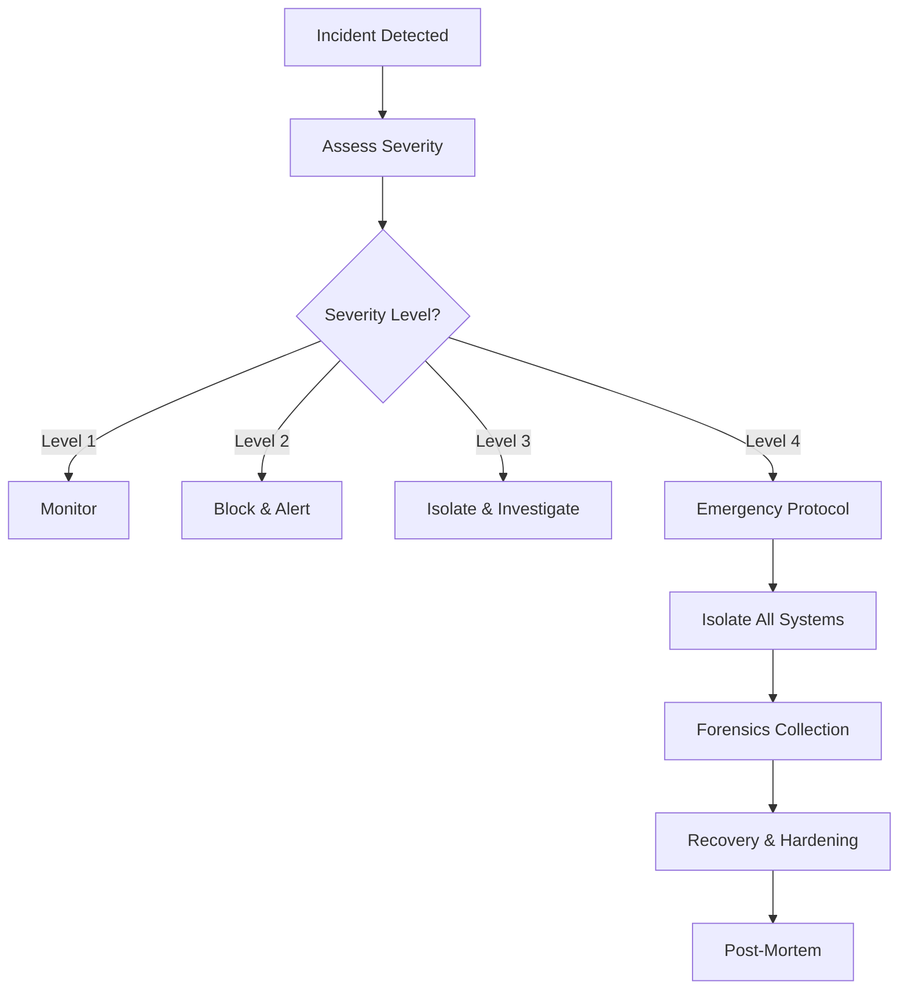

# DINARI BLOCKCHAIN: DISASTER RECOVERY & OPERATIONS PLAYBOOK

## 🚨 EMERGENCY CONTACTS

**Severity Levels:**
- **P0 (Critical):** Mainnet down, data loss, security breach
- **P1 (High):** Performance degradation, partial outage
- **P2 (Medium):** Minor issues, no user impact
- **P3 (Low):** Cosmetic issues, feature requests

**On-Call Rotation:**
```
Primary: blockchain-oncall@dinari.network
Secondary: security-team@dinari.network
Escalation: cto@dinari.network
```

---

## 📋 INCIDENT RESPONSE PROCEDURES

### P0: MAINNET DOWN

**Symptoms:**
- No new blocks for >5 minutes
- All nodes unreachable
- Database corruption
- Consensus failure

**Immediate Actions (First 5 Minutes):**

```bash
# 1. Verify the issue
./scripts/health-check.sh

# 2. Check if it's a network partition
./scripts/check-network-partition.sh

# 3. Review recent changes
git log --since="1 hour ago"

# 4. Check system resources
./scripts/check-resources.sh

# 5. Review logs for errors
./scripts/tail-critical-logs.sh
```

**Recovery Steps:**

1. **Assess Scope:**
   ```bash
   # How many nodes affected?
   kubectl get pods -n dinari-production
   
   # Check database health
   ./scripts/db-health-check.sh
   
   # Check for consensus issues
   ./scripts/consensus-status.sh
   ```

2. **Initiate Rollback (if recent deployment):**
   ```bash
   # Rollback to last known good version
   kubectl rollout undo deployment/dinari-node -n dinari-production
   kubectl rollout status deployment/dinari-node -n dinari-production
   ```

3. **Database Recovery:**
   ```bash
   # Stop all nodes
   kubectl scale deployment/dinari-node --replicas=0 -n dinari-production
   
   # Restore from latest checkpoint
   ./scripts/restore-from-checkpoint.sh
   
   # Verify database integrity
   ./scripts/verify-db-integrity.sh
   
   # Restart nodes
   kubectl scale deployment/dinari-node --replicas=5 -n dinari-production
   ```

4. **Monitor Recovery:**
   ```bash
   # Watch block production
   watch -n 5 './scripts/get-latest-block.sh'
   
   # Monitor peer connections
   watch -n 5 'kubectl exec dinari-node-0 -- curl -s localhost:8545/peers | jq .peer_count'
   ```

---

### P0: SECURITY BREACH

**Symptoms:**
- Unauthorized access detected
- Abnormal transaction patterns
- Private key exposure suspected
- DDoS attack in progress

**Immediate Actions:**

```bash
# 1. ISOLATE THE THREAT
# Block all external connections
./scripts/emergency-firewall-lockdown.sh

# 2. ACTIVATE CIRCUIT BREAKER
curl -X POST http://localhost:8545/admin/circuit-breaker/open

# 3. CAPTURE FORENSICS
./scripts/capture-forensics.sh /var/forensics/$(date +%s)

# 4. NOTIFY SECURITY TEAM
./scripts/send-security-alert.sh "P0 Security Incident"
```

**Forensics & Analysis:**

```bash
# Check for unauthorized access
./scripts/audit-access-logs.sh --since="1 hour"

# Review transaction anomalies
./scripts/detect-anomalous-transactions.sh

# Check for compromised keys
./scripts/scan-for-compromised-keys.sh

# Network traffic analysis
./scripts/analyze-network-traffic.sh
```

**Containment:**

```bash
# Rotate all keys
./scripts/emergency-key-rotation.sh

# Blacklist suspicious IPs
./scripts/blacklist-ips.sh /tmp/suspicious-ips.txt

# Enable enhanced monitoring
./scripts/enable-enhanced-monitoring.sh

# Activate rate limiting
./scripts/aggressive-rate-limiting.sh
```

---

### P0: DATA CORRUPTION

**Symptoms:**
- State root mismatch
- Block validation failures
- Database consistency errors

**Recovery Procedure:**

```bash
# 1. STOP ALL NODES IMMEDIATELY
kubectl scale deployment/dinari-node --replicas=0 -n dinari-production

# 2. IDENTIFY CORRUPTION POINT
./scripts/find-corruption-point.sh

# 3. RESTORE FROM CHECKPOINT
# Find last good checkpoint
./scripts/list-checkpoints.sh | tail -5

# Restore from specific checkpoint
./scripts/restore-checkpoint.sh checkpoint_1234567890

# 4. VERIFY RESTORATION
./scripts/verify-chain-integrity.sh

# 5. RESTART NODES
kubectl scale deployment/dinari-node --replicas=5 -n dinari-production

# 6. FORCE RESYNC IF NEEDED
./scripts/force-resync-all-nodes.sh
```

---

## 🔄 BACKUP & RESTORE PROCEDURES

### Automated Backup Schedule

**Hourly Backups:**
```bash
# Incremental state snapshots
0 * * * * /opt/dinari/scripts/hourly-snapshot.sh
```

**Daily Backups:**
```bash
# Full database backup
0 2 * * * /opt/dinari/scripts/daily-full-backup.sh
```

**Weekly Backups:**
```bash
# Long-term archive
0 3 * * 0 /opt/dinari/scripts/weekly-archive.sh
```

### Manual Backup Creation

```bash
# Create full backup
./scripts/backup/create-full-backup.sh

# Create incremental backup
./scripts/backup/create-incremental-backup.sh

# Backup to remote location
./scripts/backup/backup-to-s3.sh \
  --bucket dinari-backups-production \
  --region us-east-1
```

### Restore Procedures

**Restore from Local Backup:**
```bash
# List available backups
./scripts/backup/list-backups.sh

# Restore specific backup
./scripts/backup/restore-backup.sh \
  --backup-id backup_20250110_020000 \
  --target-dir /var/lib/dinari/data

# Verify restoration
./scripts/backup/verify-restore.sh
```

**Restore from S3:**
```bash
# Download from S3
./scripts/backup/download-from-s3.sh \
  --bucket dinari-backups-production \
  --backup-id backup_20250110_020000 \
  --target /tmp/restore

# Restore
./scripts/backup/restore-backup.sh \
  --backup-dir /tmp/restore \
  --target-dir /var/lib/dinari/data
```

---

## 🔍 MONITORING & ALERTING

### Critical Metrics to Monitor

**Blockchain Health:**
- Block production rate (target: 1 block/15 seconds)
- Transaction throughput (target: >100 TPS)
- Peer count (minimum: 20 peers)
- Orphan block rate (target: <1%)

**System Health:**
- CPU usage (alert: >80%)
- Memory usage (alert: >85%)
- Disk usage (alert: >80%)
- Network bandwidth (alert: >80%)

**Security Metrics:**
- Failed authentication attempts (alert: >50/minute)
- Invalid transaction rate (alert: >10%)
- Rate limit violations (alert: >100/minute)
- Banned IP count (alert: >100)

### Alert Configuration

```yaml
# /etc/dinari/alerts.yml
alerts:
  - name: block_production_stalled
    condition: "blocks_per_minute < 4"
    severity: critical
    cooldown: 5m
    
  - name: high_orphan_rate
    condition: "orphan_rate > 0.05"
    severity: high
    cooldown: 10m
    
  - name: peer_count_low
    condition: "peer_count < 10"
    severity: high
    cooldown: 15m
    
  - name: memory_exhaustion
    condition: "memory_usage_percent > 90"
    severity: critical
    cooldown: 5m
```

---

## 🛠️ MAINTENANCE PROCEDURES

### Scheduled Maintenance Window

**Pre-Maintenance:**
```bash
# 1. Notify users (24 hours advance)
./scripts/maintenance/send-maintenance-notice.sh \
  --date "2025-01-15" \
  --time "02:00 UTC" \
  --duration "2 hours"

# 2. Create pre-maintenance backup
./scripts/backup/create-full-backup.sh \
  --tag "pre-maintenance"

# 3. Run health checks
./scripts/health-check-full.sh > /tmp/pre-maintenance-health.log
```

**During Maintenance:**
```bash
# 1. Enable maintenance mode
./scripts/maintenance/enable-maintenance-mode.sh

# 2. Stop accepting new transactions
curl -X POST http://localhost:8545/admin/mempool/freeze

# 3. Perform updates
kubectl set image deployment/dinari-node \
  dinari-node=dinari-blockchain:v2.0.0

# 4. Wait for rollout
kubectl rollout status deployment/dinari-node

# 5. Run validation
./scripts/validation/post-update-validation.sh
```

**Post-Maintenance:**
```bash
# 1. Unfreeze mempool
curl -X POST http://localhost:8545/admin/mempool/unfreeze

# 2. Disable maintenance mode
./scripts/maintenance/disable-maintenance-mode.sh

# 3. Monitor for issues
./scripts/monitoring/post-maintenance-monitor.sh --duration 30m

# 4. Send completion notice
./scripts/maintenance/send-completion-notice.sh
```

### Database Compaction

```bash
# Check database size
./scripts/db/get-db-size.sh

# Perform offline compaction (during maintenance)
./scripts/db/compact-database.sh

# Verify post-compaction
./scripts/db/verify-integrity.sh
```

---

## 📊 PERFORMANCE OPTIMIZATION

### Node Optimization Checklist

```bash
# System tuning
./scripts/optimization/tune-system-parameters.sh

# Database optimization
./scripts/optimization/optimize-database.sh

# Network optimization
./scripts/optimization/optimize-network.sh

# Memory optimization
./scripts/optimization/optimize-memory.sh
```

### Load Testing

```bash
# Pre-deployment load test
./scripts/test/load-test.sh \
  --target testnet.dinari.network \
  --duration 30m \
  --tps 200

# Analyze results
./scripts/test/analyze-load-test-results.sh
```

---

## 🔐 SECURITY INCIDENT RESPONSE

### Incident Classification

**Level 1: Information Gathering**
- Suspicious activity detected
- Anomaly in logs
- Action: Monitor and investigate

**Level 2: Attempted Breach**
- Failed authentication attempts
- DDoS attempt
- Action: Block source, enhance monitoring

**Level 3: Successful Breach**
- Unauthorized access
- Data exfiltration
- Action: Incident response, forensics, recovery

**Level 4: Critical Compromise**
- Private key exposure
- Database compromise
- Action: Full incident response, public disclosure

### Security Incident Workflow



---

## 📝 POST-INCIDENT REVIEW

### Required Documentation

1. **Incident Timeline:**
   - Detection time
   - Response actions
   - Resolution time
   - Root cause

2. **Impact Assessment:**
   - Affected users
   - Data integrity
   - Financial impact
   - Reputation impact

3. **Remediation:**
   - Immediate fixes
   - Long-term improvements
   - Process changes
   - Training needs

### Post-Mortem Template

```markdown
# Post-Incident Report

## Executive Summary
[Brief overview]

## Incident Details
- Date/Time: 
- Duration: 
- Severity: 
- Impact: 

## Timeline
[Detailed timeline of events]

## Root Cause Analysis
[What went wrong and why]

## Response Actions
[What was done to resolve]

## Lessons Learned
[What we learned]

## Action Items
- [ ] Immediate fix 1
- [ ] Immediate fix 2
- [ ] Long-term improvement 1
- [ ] Long-term improvement 2

## Prevention Measures
[How to prevent recurrence]
```

---

## 🎯 SLA TARGETS

**Availability:**
- Target: 99.9% uptime
- Maximum downtime: 43 minutes/month

**Performance:**
- Block time: 15 seconds ±2 seconds
- Transaction finality: <60 seconds
- API response time: <500ms (p99)

**Recovery:**
- RTO (Recovery Time Objective): 15 minutes
- RPO (Recovery Point Objective): 5 minutes

---

## ✅ RUNBOOK CHECKLIST

### Daily Operations
- [ ] Review overnight alerts
- [ ] Check system metrics dashboard
- [ ] Verify backup completion
- [ ] Review security logs
- [ ] Check peer health

### Weekly Operations
- [ ] Performance review
- [ ] Security audit
- [ ] Capacity planning review
- [ ] Update documentation
- [ ] Team sync meeting

### Monthly Operations
- [ ] Disaster recovery drill
- [ ] Full security audit
- [ ] Compliance review
- [ ] Infrastructure review
- [ ] Cost optimization

---

**Document Owner:** DevOps Team  
**Last Updated:** January 2025  
**Review Schedule:** Monthly  
**Emergency Hotline:** +1-XXX-XXX-XXXX
